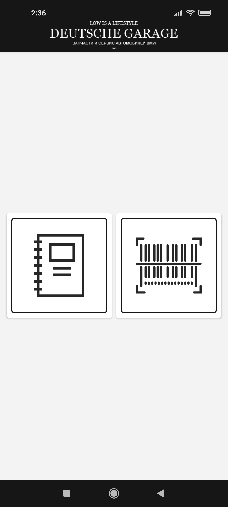
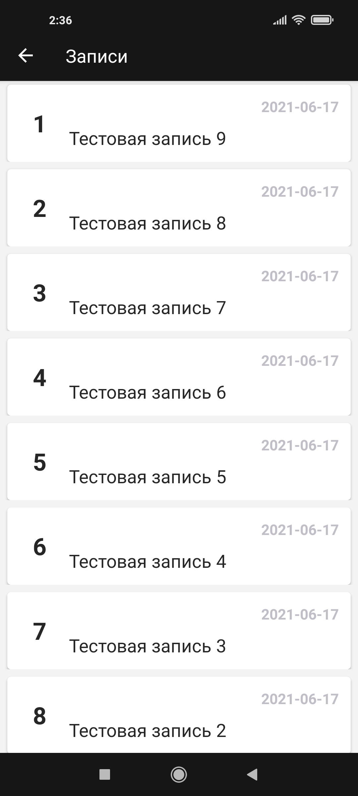
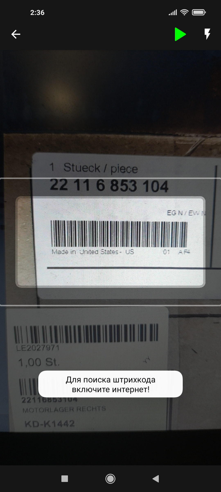
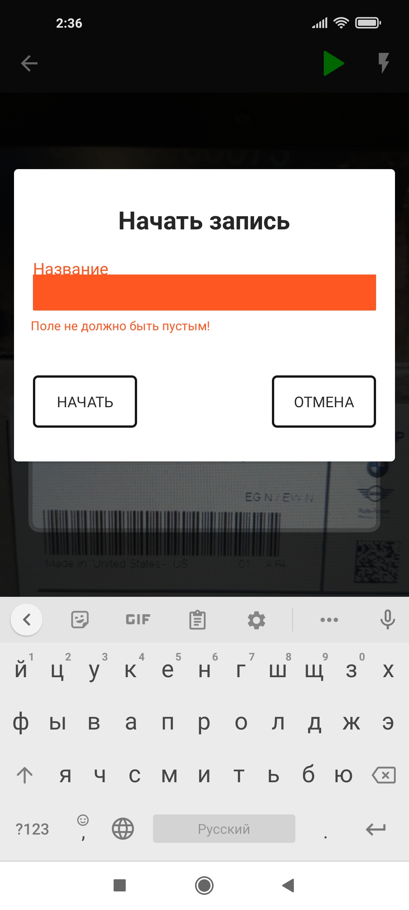
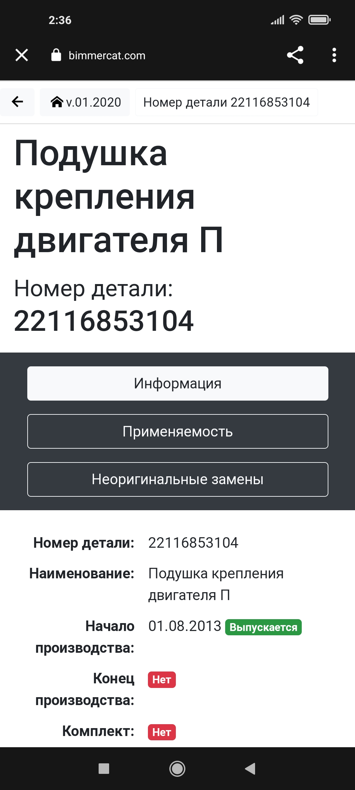

# Deutsche garage

It`s an android application designed for [Deutsche Garage](http://d-garage.com.ua/) company. This application helps 
to register the goods when a new product arrives at the warehouse.

## Functional

- scanning barcode of car spare part that arrived to warehouse and open description on [Bimmercat](http://bimmercat.com/).
- parse [Bimmercat](http://bimmercat.com/) and collect information about car spare parts.
- creating a record of accounting for the arrival of spare parts to the warehouse and automatically adding them 
  to it during scanning, and save this information to DB.
- view records and their details, delete them, and share its details in text format.

## Release notes

- ### **_v1.2:_**
  - refactoring design of application
  - created database
  - created a recording of accounting for the arrival of spare parts to the warehouse
  - created an activity where records can be viewed, shared, and deleted
  - fix, and some improvement of project code from previous versions

- ### **_v1.1:_**
  - replace parsing html part description and showing results by redirecting user direct to web site according to customer requirement
  - refactoring code according to changes and delete useless files

- ### **_v1.0:_**
  - created first version of application
  - created html parser 
  - created barcode scanner service
  
## Screenshot

    
    